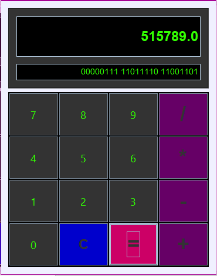

# Calculadora Swing



Este projeto implementa uma **calculadora** em Java x Swing, construída usando o **GUI Builder** do NetBeans (JForm), com interface gráfica personalizada e lógica de operações encadeadas, exibindo resultados em **decimal** e **binário** (agrupado em bytes).

---

## Índice

1. [Visão Geral](#visão-geral)
2. [Pré-requisitos](#pré-requisitos)
3. [Instalação e Execução](#instalação-e-execução)
4. [Estrutura do Projeto](#estrutura-do-projeto)
5. [Detalhes de Construção](#detalhes-de-construção)
6. [Como Funciona](#como-funciona)
7. [Personalização Visual](#personalização-visual)
8. [Contribuições](#contribuições)
9. [Licença](#licença)

---

## Visão Geral

Esta calculadora tem:

* Componentes Swing montados via **JFrame Form** (GUI Builder).
* Um único `ActionListener` para tratar todos os botões (não há listener por botão).
* **Cinco estados** para controlar a máquina (INICIO, DIGITANDO, OPERADOR, RESULTADO, ERRO).
* Exibição de resultado em **decimal** e em **binário**, formatado em grupos de 8 bits (bytes).
* Botão **C** para limpar tudo e começar nova operação.
* Bloqueio de operações com `*` ou `/` logo no início.
* Operações **encadeadas** suportadas (ex.: `10 + 5 =` → `15`, seguido de `+ 5 =` → `20`).

---

## Pré-requisitos

* Java JDK Recomendado = 24.0.1
* Apache Maven 3.6+
* NetBeans Recomendado = IDE 26 (opcional, para editar em GUI Builder).

---

## Instalação e Execução

1. **Clone** o repositório:

   ```bash
   git clone https://github.com/NeroPRDO/Calculadora_Swing.git

   ```

2. **Compilar e executar** via Maven:

   ```bash
   mvn clean compile exec:java
   ```

3. **Ou** abrir no NetBeans:

   * **File → Open Project** e selecione a pasta `calculadora-swing`.
   * Clique em **Run** (botão ▶) para iniciar.

---

## Estrutura do Projeto

```
calculadora-swing/
├ pom.xml                # Configuração Maven (exec-maven-plugin)
└ src/main/java/
   └ ds131/pedro/calculadora/calculadoralpoo/
       ├ EstadoCalculadora.java   # Enum de estados da máquina
       └ CalculadoraForm.java     # JFrame Form com initComponents + lógica
└ README/
   └ calculadora.png      # Imagem da interface em modo dark
```

---

## Detalhes de Construção

1. **GUI Builder**:

   * Usei **JFrame Form** para criar `CalculadoraForm.java`.
   * Dois `JPanel`s: `panelDisplay` (NORTH) com `txtDecimal` e `txtBinario`, e `panelBotoes` (CENTER) com GridLayout(4×4).
   * Configurei `GroupLayout` no `panelDisplay` para ancoragem responsiva.

2. **Lógica**:

   * Criei `enum EstadoCalculadora` para controlar o fluxo:

     ```java
     public enum EstadoCalculadora {
       INICIO, DIGITANDO, OPERADOR, RESULTADO, ERRO;
     }
     ```
   * No construtor: chamei `initComponents()`, registrei **um** `ActionListener` em todos os 16 botões e inicializamos os estados.
   * Método `actionPerformed(ActionEvent e)` redireciona para `processCommand(String cmd)`, que implementa a máquina de estados.

3. **Operações Encadeadas**:

   * Após `=`, se o usuário pressionar um operador, pegamos o resultado atual como `valorAnterior`, atualizamos `operadorAtual` e mudamos para estado `OPERADOR`, permitindo continuação.

4. **Conversão Binária**:

   * Arredondamos o resultado (`Math.round`), convertemos para `Long.toBinaryString`, e então inserimos espaços a cada 8 bits (bytes).

---

## Como Funciona

* Ao iniciar, `estado = INICIO`.
* Pressionar dígitos muda para `DIGITANDO`, acumulando no `txtDecimal`.
* Pressionar operador em `DIGITANDO` grava `valorAnterior` e `operadorAtual`, mudando para `OPERADOR`.
* Pressionar dígitos em `OPERADOR` começa o segundo operando.
* Pressionar `=` em `DIGITANDO` executa `calculateAndDisplay()`, exibindo decimal e binário, mudando para `RESULTADO`.
* Em `RESULTADO`, pressionar operadores ou dígitos permite encadeamento ou reinício.
* Pressionar `C` em qualquer estado limpa tudo e volta para `INICIO`.

---

2025 Pedro Eduardo Dall Agnol
UFPR

"Ulfroegni be with you, for he shows the way."
